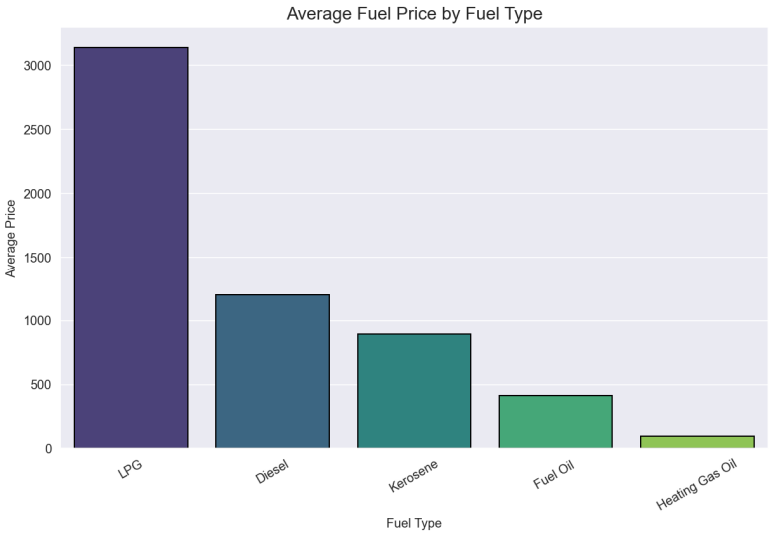
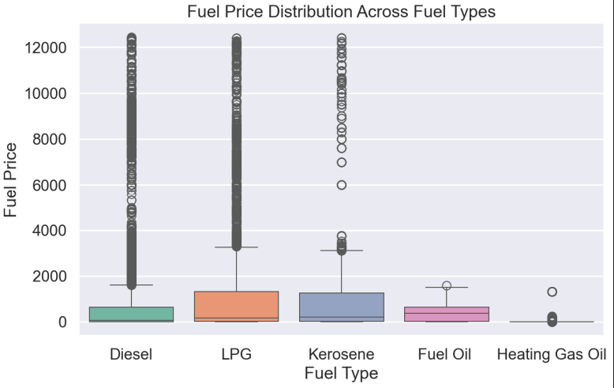
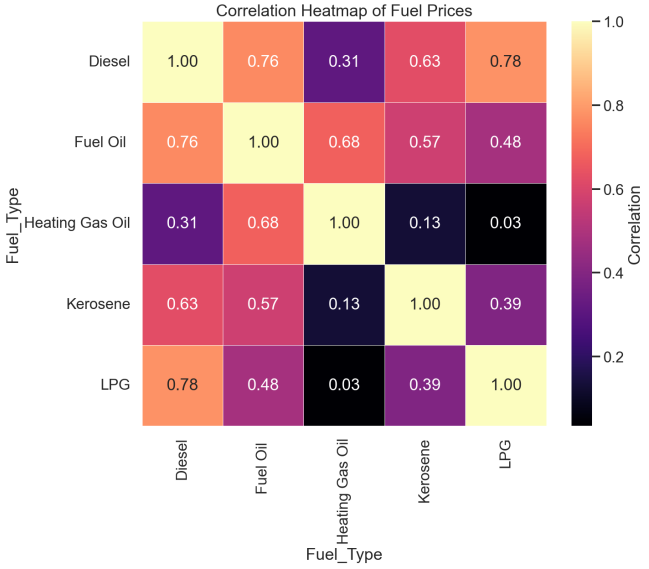
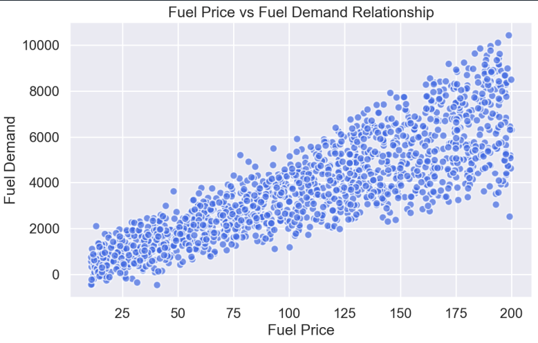
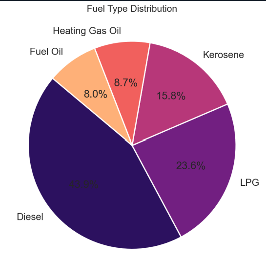
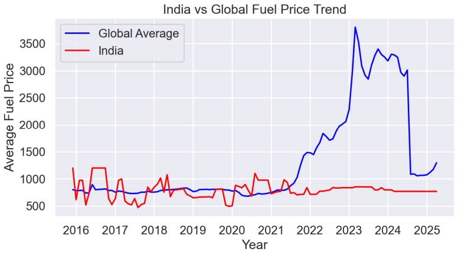
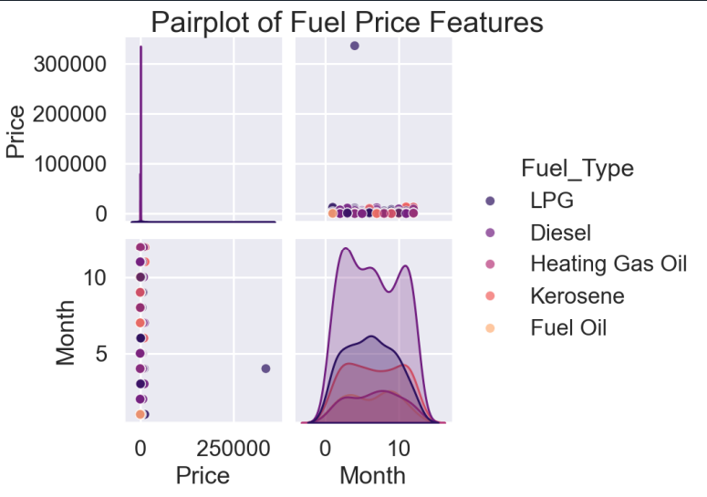
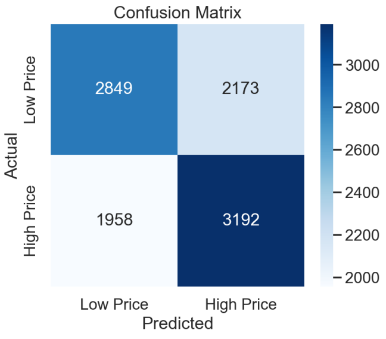

# Global Fuel Price Analysis

## Project Overview

**Global Fuel Price Analysis** is a data science project designed to study fuel price patterns across different countries and fuel categories. The project focuses on cleaning and transforming a multi-sheet fuel price dataset, performing exploratory data analysis, creating meaningful visualizations, and applying a machine learning model to classify fuel prices.

The analysis gives special attention to global fuel price trends and the comparison of India with worldwide averages. This makes the project useful for understanding fuel price variation, identifying high-price fuel categories, and interpreting price behavior through statistical and visual analysis.

## Objectives of the Project

The main objectives of this project are:

- To load and combine fuel price data from multiple Excel sheets.
- To transform the dataset into a clean and analysis-ready format.
- To perform data preprocessing, including duplicate removal, missing value handling, date conversion, and normalization.
- To analyze fuel price trends across different countries and fuel types.
- To compare India's fuel prices with global fuel price trends.
- To create clear and well-labeled visualizations for data interpretation.
- To apply a machine learning model for fuel price classification.
- To evaluate the model performance using a confusion matrix.

## Dataset Description

The dataset contains fuel price information for multiple fuel types across different countries and dates. The data is stored in an Excel workbook and includes fuel categories such as:

- Diesel
- LPG
- Kerosene
- Fuel Oil
- Heating Gas Oil

The combined dataset is available in the repository under:

```text
dataset/combined_fuel_dataset.xlsx
```

Key dataset fields used in the analysis include:

- **Country**: Name of the country.
- **Date**: Time period of the recorded fuel price.
- **Price**: Fuel price value.
- **Fuel_Type**: Type of fuel, such as Diesel, LPG, Kerosene, Fuel Oil, or Heating Gas Oil.

## Technologies Used

The project uses the following Python libraries and tools:

- **Python**: Main programming language for the project.
- **Pandas**: Data loading, cleaning, merging, and transformation.
- **NumPy**: Numerical operations and array-based calculations.
- **Matplotlib**: Static data visualization.
- **Seaborn**: Statistical visualization and enhanced plot styling.
- **Scikit-learn**: Data normalization, machine learning model building, and model evaluation.

## Data Preprocessing Steps

The preprocessing stage prepares the raw dataset for reliable analysis and modeling. The major steps include:

- Loading all Excel sheets from the dataset.
- Combining all fuel type sheets into one dataset.
- Converting the dataset into long format.
- Standardizing columns such as `Country`, `Date`, `Price`, and `Fuel_Type`.
- Removing duplicate records.
- Handling missing values in the price column.
- Converting the date column into a valid datetime format.
- Removing or correcting invalid price values.
- Normalizing the fuel price column using `MinMaxScaler`.
- Creating additional time-based features such as month and year where required.

## Exploratory Data Analysis (EDA)

Exploratory Data Analysis was performed to understand the structure, distribution, and relationships in the dataset. The EDA process includes:

- Summary statistics of fuel prices.
- Distribution analysis across fuel types.
- Country-wise comparison of fuel prices.
- Correlation analysis between fuel categories.
- Trend analysis for India and global fuel prices.
- Identification of high-price and low-price fuel groups.

EDA helps reveal important patterns in the dataset before applying machine learning techniques.

## Visualizations

This project includes several visualizations to make the analysis clear and easy to interpret.

### Bar Plot: Average Fuel Price by Fuel Type

The bar plot compares the average price of different fuel types and helps identify which fuel category has the highest average price.



### Box Plot: Fuel Price Distribution

The box plot shows the distribution, spread, and outliers in fuel prices across different fuel types.



### Heatmap: Correlation Analysis

The heatmap displays the correlation between different fuel types and helps identify relationships among fuel price movements.



### Scatter Plot: Fuel Price and Demand Relationship

The scatter plot visualizes the relationship between fuel price and fuel demand, showing how demand may vary with price changes.



### Pie Chart: Fuel Type Distribution

The pie chart shows the percentage distribution of fuel types in the dataset.



### India vs Global Fuel Price Trend

This visualization compares India's fuel price trend with the global average trend, making India's position easier to interpret.



### Pair Plot: Fuel Price Features

The pair plot provides a combined view of relationships between selected numerical features.



## Machine Learning Model

The project includes a machine learning model for fuel price classification.

### Logistic Regression

Logistic Regression is used to classify fuel prices into categories such as:

- Low Price
- High Price

The model uses processed fuel price features to learn patterns and predict whether a fuel price belongs to a low-price or high-price category.

### Model Evaluation

The model performance is evaluated using a confusion matrix. The confusion matrix compares actual and predicted classes and helps measure classification performance.



The confusion matrix helps identify:

- Correctly predicted low-price values.
- Correctly predicted high-price values.
- Low-price values incorrectly classified as high-price.
- High-price values incorrectly classified as low-price.

## Key Insights

Based on the analysis and visualizations, the project highlights the following insights:

- LPG shows a comparatively high average fuel price among the analyzed fuel types.
- Diesel has a large share in the dataset and shows significant variation across countries.
- Fuel prices vary widely between fuel types, countries, and time periods.
- The box plot shows the presence of outliers, especially in high-priced fuel categories.
- Correlation analysis suggests that some fuel categories move together more closely than others.
- India's fuel price trend can be compared clearly against the global average, helping identify periods where India is above or below the global trend.
- The Logistic Regression model provides a basic classification approach for separating low and high fuel price categories.

## Project Structure

```text
Global Fuel Price Analysis/
|-- README.md
|-- Global_fuelPrice_Analysis.py
|-- requirements.txt
|-- dataset/
|   `-- combined_fuel_dataset.xlsx
`-- outputs/
    |-- Bar_plot.png
    |-- Box_plot.png
    |-- Heatmap.png
    |-- Scatter_plot.png
    |-- Pieplot.png
    |-- Pairpot.png
    |-- Confusion_Matrix.png
    `-- India_vs_global_price.png
```

## How to Run the Project

### 1. Clone the Repository

```bash
git clone https://github.com/StutiJain4999/Python-Project.git Global-Fuel-Price-Analysis
```

### 2. Open the Project Folder

```bash
cd Global-Fuel-Price-Analysis
```

### 3. Install Required Libraries

```bash
pip install -r requirements.txt
```

### 4. Run the Python Script

```bash
python Global_fuelPrice_Analysis.py
```

The analysis script loads the dataset, performs preprocessing, generates visualizations, and applies the machine learning model.

## Future Improvements

Possible future enhancements include:

- Adding more recent fuel price data for updated trend analysis.
- Converting all fuel prices into a common currency for stronger global comparison.
- Improving country-level analysis with regional grouping.
- Adding interactive dashboards using Power BI, Plotly, or Streamlit.
- Testing advanced machine learning models such as Random Forest, XGBoost, or time-series forecasting models.
- Adding more performance metrics such as accuracy, precision, recall, and F1-score.
- Automating report generation for monthly or yearly fuel price summaries.

## Author Section

**Project Name:** Global Fuel Price Analysis  
**Author:** Stuti Jain  
**Project Type:** University Data Science Project  
**Repository:** [Global Fuel Price Analysis](https://github.com/StutiJain4999/Python-Project)

This project demonstrates practical skills in data cleaning, exploratory data analysis, visualization, and machine learning using Python.
